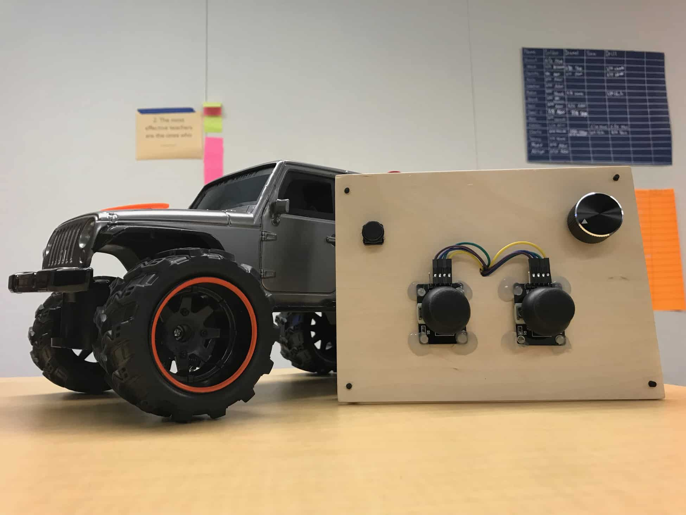
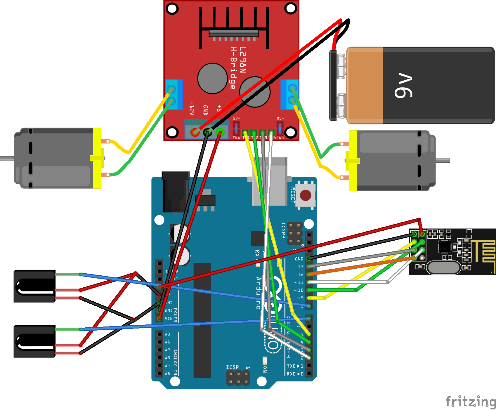
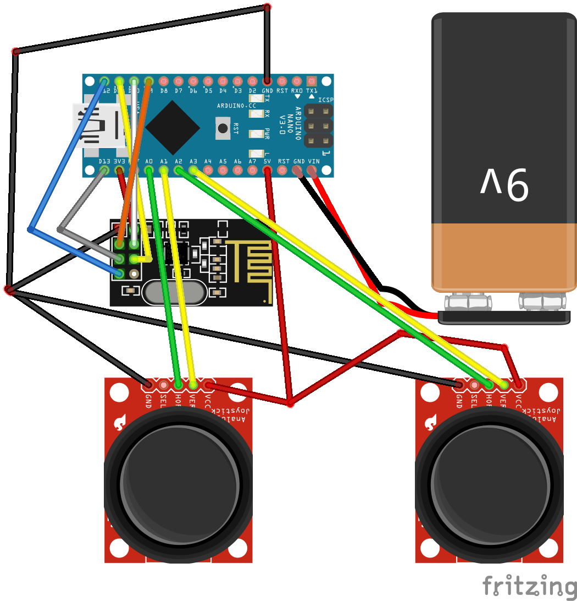
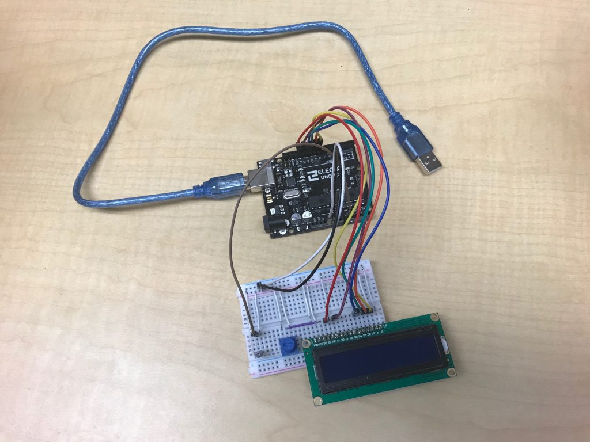

# IR Line Following Car
The IR Line Following Car is a RC car retrofitted with two IR sensors to detect and follow a line. The car is also implemented with various modes such as a regular remote control mode and an obstacle avoidance mode. 

6/15/2024: With the BlueStamp portfolios being on GitHub pages now (which are easier to edit compared to the previous use of WordPress), I remade my portfolio on here. Original can be found here [here](https://projects.bluestampengineering.com/student-projects/terry-w/). Some minor tweaks/additions were made but most of it has been copied and pasted. Some formatting inconsistencies exist because the content back in 2019 was different from now. I like how WordPress provides galleries (seems like they can be added too on GitHub pages but more work - [example](https://github.com/opieters/jekyll-image-gallery-example/blob/gh-pages/README.md)). Too lazy to make lots of other changes such as links, may add in the future when I desire it. Am also attempting to find the code somewhere in my storage drives.

| **Engineer** | **School** | **Area of Interest** | **Grade** |
|:--:|:--:|:--:|:--:|
| Terry W | Bellarmine College Preparatory | Mechanical Engineering and Computer Science | Rising Sophomore



# Bonus: Reflection and Demo Night
<iframe width="560" height="315" src="https://www.youtube.com/embed/YhFRTvm5hH0?si=2fnlI6oegThNSuZw" title="YouTube video player" frameborder="0" allow="accelerometer; autoplay; clipboard-write; encrypted-media; gyroscope; picture-in-picture; web-share" referrerpolicy="strict-origin-when-cross-origin" allowfullscreen></iframe>

Overall, I would say my experience at BlueStamp was awesome, and couldn’t have been better. BlueStamp taught me to improve my time management, as I had to effectively manage my time throughout the six weeks. BlueStamp also taught me to improve my work ethic, such as organizing all my parts, and working efficiently. The mentors really pushed me to learn on my own. I had a lot of fun learning about various electronic components, interacting with my peers, and making new friends along the way. I would definitely like to thank my mentors in the room, Asher, Rish, Skye, and Eduardo. Couldn’t have done it without them!
  
# Final Milestone
<iframe width="560" height="315" src="https://www.youtube.com/embed/ZLZ4DCxbuR8?si=dkZ0WlbfLeV8Oz4e" title="YouTube video player" frameborder="0" allow="accelerometer; autoplay; clipboard-write; encrypted-media; gyroscope; picture-in-picture; web-share" referrerpolicy="strict-origin-when-cross-origin" allowfullscreen></iframe>

For my third milestone, I decided to make a remote control for my car. A lot of my time and effort was spent on learning/figuring out how to make the two NRFs communicate between each other, and trying to solder all my connections.

My remote control mode is made up of an Arduino Nano, two NRFs, and two joysticks. The two joysticks are soldered to the Nano, and to one nRF. The other nRF is on my car, wired to my Arduino Uno. The two joysticks provide analog data through two potentiometers, one on the x-axis, and one on the y-axis.

# Second Milestone
<iframe width="560" height="315" src="https://www.youtube.com/embed/iO6ywPNrVGQ?si=Kn5Re6fvSySsbivz" title="YouTube video player" frameborder="0" allow="accelerometer; autoplay; clipboard-write; encrypted-media; gyroscope; picture-in-picture; web-share" referrerpolicy="strict-origin-when-cross-origin" allowfullscreen></iframe>

For my second milestone, I decided that I would get the line following to work. I spent a bit of time figuring what method I would use. I did eventually  figure it out, but ran into a second challenge, fine tuning my car’s movement. My car has a very wide turning radius, so I had to make many trial runs, and determine the appropriate speed for the car.

For my line following mode, I used two infrared (IR) sensors. The two IR sensors are mounted on the bottom of my car. The two sensors detect the edge of the black line it follows, and uses a method known as edge detection. If the edge of the line is detected, the car moves/turns in that specific direction.

# First Milestone
<iframe width="560" height="315" src="https://www.youtube.com/embed/KiSpSr8FIZQ?si=0R3M1hDOsGmBkLUI" title="YouTube video player" frameborder="0" allow="accelerometer; autoplay; clipboard-write; encrypted-media; gyroscope; picture-in-picture; web-share" referrerpolicy="strict-origin-when-cross-origin" allowfullscreen></iframe>

For my first milestone, I decided that gaining control of both motors would be adequate. I began by removing all of the components from the car except for the stock PCB, the motors, and the drive base. I then began analyzing my PCB, and determining whether or not it would be essential to my project. After some planning, I concluded that I would not need the PCB. I went ahead and hot glued my motor driver (SparkFun L928N) onto my drive base, and began wiring some motors. After determining the proper connections needed, I stripped, tinned, and connected my motor wires to the motor driver. I then attached jumper cables from the motor driver to the Arduino, as well as jumper cables for power. The biggest challenge I faced during my first milestone was perfecting my steering mechanism. The steering was driven by a DC motor, which I found impractical. I did a lot of testing with the motor and my code, to determine the exact speed and timing needed to turn my car. In the end, after a few days of testing, I finally found the appropriate timing and speed for my motor.

# Schematics 



# Code
```python
void setup() {
  // make stuff happen
}

void loop() {
  // make more stuff happen

}
```
<!--

# Bill of Materials
| **Part** | **Note** | **Price** | **Link** |
|:--:|:--:|:--:|:--:|
| RC Jeep | What the item is used for | $Price | <a href="https://www.amazon.com/Arduino-A000066-ARDUINO-UNO-R3/dp/B008GRTSV6/"> Link </a> |
| Joysticks (x2) | What the item is used for | $Price | <a href="https://www.amazon.com/Arduino-A000066-ARDUINO-UNO-R3/dp/B008GRTSV6/"> Link </a> |
| Motor Driver | What the item is used for | $Price | <a href="https://www.amazon.com/Arduino-A000066-ARDUINO-UNO-R3/dp/B008GRTSV6/"> Link </a> |
| Arduino Uno | What the item is used for | $Price | <a href="https://www.amazon.com/Arduino-A000066-ARDUINO-UNO-R3/dp/B008GRTSV6/"> Link </a> |
| Wireless Receiver (x2) | ? | $Price | <a href="https://www.amazon.com/Arduino-A000066-ARDUINO-UNO-R3/dp/B008GRTSV6/"> Link </a> |
| Arduino Nano | What the item is used for | $Price | <a href="https://www.amazon.com/Arduino-A000066-ARDUINO-UNO-R3/dp/B008GRTSV6/"> Link </a> |
| Button | What the item is used for | $Price | <a href="https://www.amazon.com/Arduino-A000066-ARDUINO-UNO-R3/dp/B008GRTSV6/"> Link </a> |
| Battery (x2) | What the item is used for | $Price | <a href="https://www.amazon.com/Arduino-A000066-ARDUINO-UNO-R3/dp/B008GRTSV6/"> Link </a> |
-->
# Bill of Materials
BOM commented out to see if it breaks the bottom one (stray character somewhere causing an error?)
| **Part** | **Note** | **Price** | **Link** |
|:--:|:--:|:--:|:--:|
| RC Jeep | What the item is used for | $Price | <a href="https://www.amazon.com/Arduino-A000066-ARDUINO-UNO-R3/dp/B008GRTSV6/"> Link </a> |

# Other Resources/Examples
- [My GitHub with a few schematics from 2019](https://github.com/T3rry-W/BSE2019)

# Starter Project: Temperature Sensor Display
<iframe width="560" height="315" src="https://www.youtube.com/embed/wkpTRRvu_wk?si=yXcstMhYHB4B3w3G" title="YouTube video player" frameborder="0" allow="accelerometer; autoplay; clipboard-write; encrypted-media; gyroscope; picture-in-picture; web-share" referrerpolicy="strict-origin-when-cross-origin" allowfullscreen></iframe>

My starter project is the Temperature Sensor Display. The temperature sensor display features an LCD which displays the temperature. I chose the project because I wanted to challenge myself (it was rated as one of the harder projects), found it the most interesting, and thought it would be a good balance between light coding and soldering.

The entire project consists of the following components: an Arduino Uno, a mini breadboard, jumper wires, a potentiometer, a temperature sensor, and a LCD (liquid crystal display). The core component of the entire project is the temperature sensor. The sensor works by changing its voltage output, proportionally to the change in temperature.  The Arduino then reads the analog signal, and through a series of equations, converts it into a digital signal, and displays it on the LCD.

# Schematics 


# Code
```python
void setup() {
  // easy
}

void loop() {
  // somewhere on the internet

}
```

# Bill of Materials

| **Part** | **Note** | **Price** | **Link** |
|:--:|:--:|:--:|:--:|
| Arduino Uno | What the item is used for | $Price | <a href="https://www.amazon.com/Arduino-A000066-ARDUINO-UNO-R3/dp/B008GRTSV6/"> Link </a> |
| LCD Screen | What the item is used for | $Price | <a href="https://www.amazon.com/Arduino-A000066-ARDUINO-UNO-R3/dp/B008GRTSV6/"> Link </a> |
| Potentiometer | What the item is used for | $Price | <a href="https://www.amazon.com/Arduino-A000066-ARDUINO-UNO-R3/dp/B008GRTSV6/"> Link </a> |
| Sensor | What the item is used for | $Price | <a href="https://www.amazon.com/Arduino-A000066-ARDUINO-UNO-R3/dp/B008GRTSV6/"> Link </a> |
| Breadboard | What the item is used for | $Price | <a href="https://www.amazon.com/Arduino-A000066-ARDUINO-UNO-R3/dp/B008GRTSV6/"> Link </a> |
| Jumper Wires | What the item is used for | $Price | <a href="https://www.amazon.com/Arduino-A000066-ARDUINO-UNO-R3/dp/B008GRTSV6/"> Link </a> |

# Other Resources/Examples
- [Original Portfolio](https://projects.bluestampengineering.com/student-projects/terry-w/)
- [Collection of other 2019 student portfolios](https://projects.bluestampengineering.com/2020-students/2019-students/)
